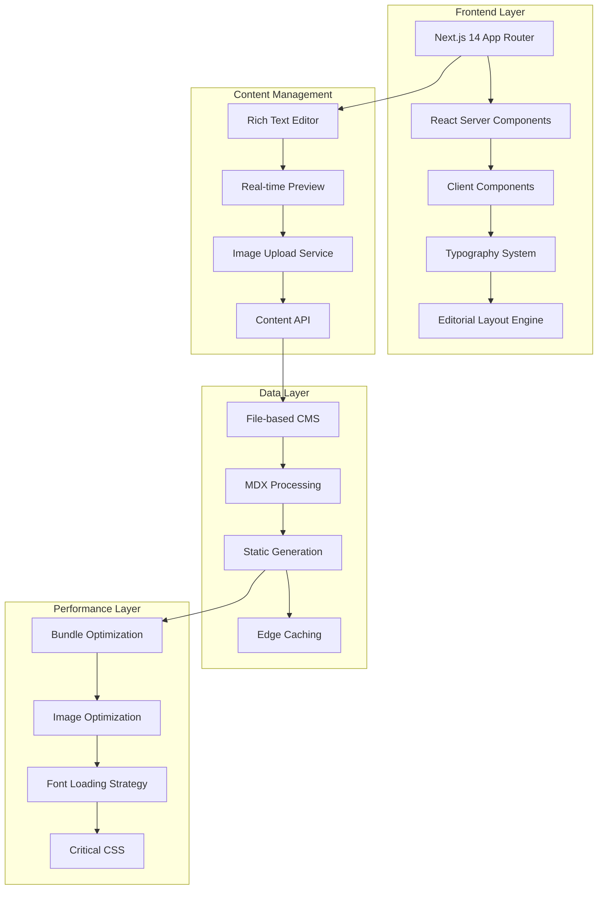

# Design Document

## Overview

This design document outlines the complete re-architecture of the Cosmic Dance blog to achieve three primary objectives: creating a lightweight, high-performance platform; implementing seamless content management with direct upload capabilities; and establishing a sophisticated typography-focused editorial design system. The redesign will transform the current Next.js blog into a modern, efficient, and visually stunning platform that prioritizes both user experience and content creator workflow.

## Architecture

### System Architecture Overview



### Technology Stack

**Frontend Framework:**
- Next.js 14 with App Router for optimal performance
- React 18 with Server Components for reduced bundle size
- TypeScript for type safety and developer experience

**Styling & Design:**
- Tailwind CSS 3.4+ with custom design system
- CSS-in-JS for dynamic styling where needed
- Custom typography scale with Japanese font optimization

**Content Management:**
- File-based CMS with MDX support
- Real-time editor with live preview
- Local file storage in public/static directory (Vercel free tier compatible)

**Performance Optimization:**
- Bundle splitting and tree shaking
- Image optimization with next/image
- Font optimization with next/font
- Edge caching with Vercel Edge Functions

## Components and Interfaces

### Core Components Architecture

#### 1. Typography System (`/components/typography/`)

```typescript
// Typography component hierarchy
interface TypographyProps {
  variant: 'display' | 'heading' | 'subheading' | 'body' | 'caption'
  size?: 'xs' | 'sm' | 'md' | 'lg' | 'xl' | '2xl' | '3xl'
  weight?: 'light' | 'normal' | 'medium' | 'semibold' | 'bold'
  color?: 'primary' | 'secondary' | 'muted' | 'accent'
  align?: 'left' | 'center' | 'right' | 'justify'
  spacing?: 'tight' | 'normal' | 'relaxed' | 'loose'
  lang?: 'ja' | 'en'
}

// Japanese typography optimization
interface JapaneseTypographyConfig {
  fontFamily: string[]
  lineHeight: number
  letterSpacing: string
  wordBreak: 'normal' | 'break-all' | 'keep-all'
  writingMode?: 'horizontal-tb' | 'vertical-rl'
}
```

#### 2. Editorial Layout System (`/components/layout/`)

```typescript
// Layout components for editorial design
interface EditorialLayoutProps {
  variant: 'magazine' | 'newspaper' | 'minimal' | 'grid'
  columns?: 1 | 2 | 3 | 4
  gap?: 'tight' | 'normal' | 'wide'
  rhythm?: 'compact' | 'comfortable' | 'spacious'
}

// Grid system for editorial layouts
interface EditorialGridProps {
  areas: string[]
  columns: string
  rows: string
  gap: string
  breakpoints: ResponsiveBreakpoints
}
```

#### 3. Enhanced Content Editor (`/components/editor/`)

```typescript
interface ContentEditorProps {
  initialContent?: string
  mode: 'create' | 'edit'
  autosave?: boolean
  collaborative?: boolean
  plugins: EditorPlugin[]
}

interface EditorPlugin {
  name: string
  toolbar: ToolbarItem[]
  shortcuts: KeyboardShortcut[]
  render: (props: any) => React.ReactNode
}

// Rich text editor features
interface EditorFeatures {
  markdown: boolean
  wysiwyg: boolean
  codeHighlighting: boolean
  imageUpload: boolean
  linkPreview: boolean
  tableEditor: boolean
  mathSupport: boolean
  japaneseInput: boolean
}
```

#### 4. Image Management System (`/components/media/`) - Vercel Free Tier Optimized

```typescript
interface ImageUploadProps {
  maxSize: 4.5 * 1024 * 1024 // 4.5MB limit for Vercel free tier
  allowedFormats: ['jpeg', 'png', 'webp']
  optimization: ImageOptimizationConfig
  storage: 'local' // public/static directory for Vercel free tier
  compression: ClientSideCompressionConfig
}

interface ImageOptimizationConfig {
  formats: ('webp' | 'jpeg' | 'png')[] // Using next/image built-in optimization
  sizes: number[]
  quality: 75 // Optimized for file size
  progressive: boolean
  placeholder: 'blur' | 'empty'
}

interface ClientSideCompressionConfig {
  maxWidth: 1920
  maxHeight: 1080
  quality: 0.8
  format: 'webp' | 'jpeg'
}
```

### API Design

#### Content Management API (`/api/content/`)

```typescript
// RESTful API for content operations
interface ContentAPI {
  // Create new post
  'POST /api/content/posts': {
    body: CreatePostRequest
    response: PostResponse
  }
  
  // Update existing post
  'PUT /api/content/posts/[slug]': {
    body: UpdatePostRequest
    response: PostResponse
  }
  
  // Upload media
  'POST /api/content/media': {
    body: FormData
    response: MediaResponse
  }
  
  // Auto-save draft
  'POST /api/content/drafts': {
    body: DraftRequest
    response: DraftResponse
  }
}

interface CreatePostRequest {
  title: string
  content: string
  summary?: string
  tags: string[]
  publishedAt?: string
  status: 'draft' | 'published'
  metadata: PostMetadata
}

interface PostMetadata {
  readingTime: number
  wordCount: number
  language: 'ja' | 'en'
  seo: SEOMetadata
}
```

## Data Models

### Content Models

#### Post Model
```typescript
interface Post {
  id: string
  slug: string
  title: string
  content: string
  summary?: string
  excerpt: string
  tags: Tag[]
  author: Author
  publishedAt: Date
  updatedAt: Date
  status: 'draft' | 'published' | 'archived'
  metadata: PostMetadata
  seo: SEOMetadata
  readingTime: number
  wordCount: number
  language: 'ja' | 'en'
  featuredImage?: Media
  gallery?: Media[]
}
```

#### Media Model
```typescript
interface Media {
  id: string
  filename: string
  originalName: string
  mimeType: string
  size: number
  width?: number
  height?: number
  url: string
  thumbnailUrl?: string
  alt?: string
  caption?: string
  uploadedAt: Date
  optimizedVersions: OptimizedVersion[]
}

interface OptimizedVersion {
  format: 'webp' | 'avif' | 'jpeg'
  width: number
  height: number
  url: string
  size: number
}
```

#### Typography Configuration Model
```typescript
interface TypographyConfig {
  fontFamilies: {
    primary: FontFamily
    secondary: FontFamily
    japanese: FontFamily
    monospace: FontFamily
  }
  scales: {
    desktop: TypeScale
    tablet: TypeScale
    mobile: TypeScale
  }
  spacing: SpacingScale
  colors: ColorPalette
}

interface FontFamily {
  name: string
  weights: number[]
  styles: ('normal' | 'italic')[]
  display: 'swap' | 'fallback' | 'optional'
  preload: boolean
}
```

## Error Handling

### Error Management Strategy

#### Client-Side Error Handling
```typescript
interface ErrorBoundaryProps {
  fallback: React.ComponentType<ErrorFallbackProps>
  onError?: (error: Error, errorInfo: ErrorInfo) => void
  resetOnPropsChange?: boolean
}

// Error types for different scenarios
type BlogError = 
  | 'NETWORK_ERROR'
  | 'VALIDATION_ERROR'
  | 'UPLOAD_ERROR'
  | 'SAVE_ERROR'
  | 'LOAD_ERROR'
  | 'PERMISSION_ERROR'

interface ErrorHandler {
  handle(error: BlogError, context: ErrorContext): void
  retry(operation: () => Promise<any>, maxRetries: number): Promise<any>
  fallback(component: React.ComponentType): React.ComponentType
}
```

#### Server-Side Error Handling
```typescript
interface APIErrorResponse {
  error: {
    code: string
    message: string
    details?: any
    timestamp: string
    requestId: string
  }
}

// Error middleware for API routes
interface ErrorMiddleware {
  catch(error: Error): APIErrorResponse
  log(error: Error, context: RequestContext): void
  notify(error: Error, severity: 'low' | 'medium' | 'high'): void
}
```

## Testing Strategy

### Testing Approach

#### Unit Testing
- Component testing with React Testing Library
- Hook testing with @testing-library/react-hooks
- Utility function testing with Jest
- Typography system testing for different languages

#### Integration Testing
- API endpoint testing
- Content creation workflow testing
- Image upload and optimization testing
- Editor functionality testing

#### Performance Testing
- Bundle size monitoring
- Core Web Vitals tracking
- Font loading performance
- Image optimization effectiveness

#### Accessibility Testing
- Screen reader compatibility
- Keyboard navigation
- Color contrast validation
- Japanese text accessibility

```typescript
// Testing utilities
interface TestingUtils {
  renderWithProviders(component: React.ReactElement): RenderResult
  mockContentAPI(): MockedAPI
  createMockPost(overrides?: Partial<Post>): Post
  simulateTyping(element: HTMLElement, text: string): void
  waitForImageLoad(src: string): Promise<void>
}
```

## Performance Optimization Strategy

### Bundle Optimization
- **Code Splitting**: Route-based and component-based splitting
- **Tree Shaking**: Eliminate unused code from dependencies
- **Dynamic Imports**: Load heavy components on demand
- **Preact in Production**: Replace React with Preact for smaller bundle

### Font Loading Strategy
```typescript
interface FontLoadingStrategy {
  // Critical fonts loaded immediately
  critical: {
    families: ['M PLUS 1p', 'DM Sans']
    display: 'swap'
    preload: true
  }
  
  // Non-critical fonts loaded after page load
  deferred: {
    families: ['Space Grotesk', 'Crimson Text']
    display: 'optional'
    preload: false
  }
  
  // Font subsetting for Japanese characters
  subsetting: {
    japanese: {
      unicodeRange: 'U+3040-309F, U+30A0-30FF, U+4E00-9FAF'
      characters: 'commonly-used-kanji-set'
    }
  }
}
```

### Image Optimization Pipeline - Vercel Free Tier Optimized
```typescript
interface ImageOptimizationPipeline {
  upload: {
    maxSize: 4.5 * 1024 * 1024 // 4.5MB limit for Vercel free tier
    allowedFormats: ['jpeg', 'png', 'webp']
    validation: ImageValidator
    clientCompression: true // Compress before upload
  }
  
  processing: {
    formats: ['webp', 'jpeg'] // Using next/image built-in optimization
    sizes: [320, 640, 960, 1280] // Reduced sizes for bandwidth efficiency
    quality: 75 // Optimized for file size vs quality
    progressive: true
  }
  
  delivery: {
    storage: 'local' // public/static directory
    caching: 'max-age=31536000'
    lazyLoading: true
    placeholder: 'blur'
    bandwidthOptimization: true // Consider 100GB monthly limit
  }
}
```

## Design System Implementation

### Typography Hierarchy
```css
/* Editorial Typography Scale */
.text-display {
  font-size: clamp(3rem, 8vw, 6rem);
  line-height: 1.1;
  letter-spacing: -0.02em;
  font-weight: 700;
  font-family: 'Space Grotesk', 'M PLUS 1p', sans-serif;
}

.text-heading-1 {
  font-size: clamp(2rem, 5vw, 3.5rem);
  line-height: 1.2;
  letter-spacing: -0.01em;
  font-weight: 600;
}

.text-body-editorial {
  font-size: 1.125rem;
  line-height: 1.8;
  letter-spacing: 0.01em;
  font-family: 'DM Sans', 'M PLUS 1p', sans-serif;
}

/* Japanese Typography Optimization */
.text-japanese {
  font-family: 'M PLUS 1p', 'Hiragino Kaku Gothic ProN', 'Yu Gothic', sans-serif;
  line-height: 1.9;
  letter-spacing: 0.05em;
  word-break: break-all;
  overflow-wrap: break-word;
}
```

### Color System
```typescript
interface EditorialColorSystem {
  primary: {
    50: '#f8fafc'
    100: '#f1f5f9'
    500: '#64748b'
    900: '#0f172a'
  }
  
  accent: {
    editorial: '#2563eb'
    highlight: '#f59e0b'
    success: '#10b981'
    warning: '#f59e0b'
    error: '#ef4444'
  }
  
  typography: {
    primary: '#1e293b'
    secondary: '#64748b'
    muted: '#94a3b8'
    inverse: '#ffffff'
  }
  
  backgrounds: {
    paper: '#ffffff'
    subtle: '#f8fafc'
    muted: '#f1f5f9'
    dark: '#0f172a'
  }
}
```

### Layout Grid System
```css
/* Editorial Grid System */
.editorial-grid {
  display: grid;
  grid-template-columns: 
    [full-start] minmax(1rem, 1fr)
    [content-start] minmax(0, 65ch)
    [content-end] minmax(1rem, 1fr)
    [full-end];
  gap: 2rem;
}

.editorial-grid > * {
  grid-column: content;
}

.editorial-grid > .full-width {
  grid-column: full;
}

/* Magazine-style layouts */
.magazine-layout {
  display: grid;
  grid-template-areas:
    "hero hero hero"
    "main main sidebar"
    "footer footer footer";
  grid-template-columns: 1fr 1fr 300px;
  gap: 2rem;
}
```

## Migration Strategy

### Content Migration Plan
1. **Data Export**: Extract all existing posts, images, and metadata
2. **Content Transformation**: Convert existing MDX files to new format
3. **Image Migration**: Transfer and optimize all media files
4. **URL Preservation**: Maintain existing URLs with proper redirects
5. **SEO Maintenance**: Preserve meta tags, structured data, and rankings

### Deployment Strategy
1. **Staging Environment**: Deploy new system alongside existing blog
2. **A/B Testing**: Gradual rollout with performance monitoring
3. **Content Sync**: Real-time synchronization during transition
4. **DNS Cutover**: Seamless switch with minimal downtime
5. **Monitoring**: Comprehensive performance and error tracking

This design provides a comprehensive foundation for building a lightweight, content-creator-friendly blog with sophisticated typography and editorial design. The architecture prioritizes performance, user experience, and maintainability while supporting both Japanese and English content creation workflows.